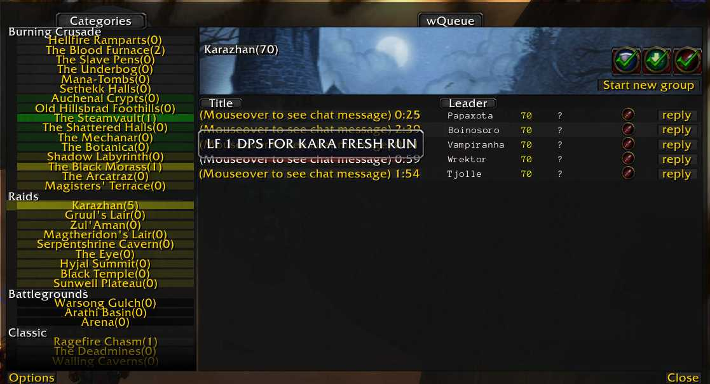
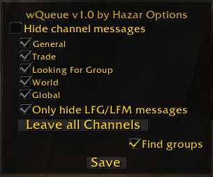

# wQueue

### [Download Latest](https://github.com/fondlez/wQueue/releases/latest)

A re-upload of a wonderful Looking for Group addon ported to TBC by 
Hazar (2017). It is similar to the "vQueue" vanilla 1.1.12 WoW addon.

## Description
wQueue shows and organizes LFM/LFG chat messages for vanilla and TBC dungeons 
and raids. Unusually, it also allows making your own LFG chat messages.

## Graphical Interface

### Main Window

### Options from Main Window

